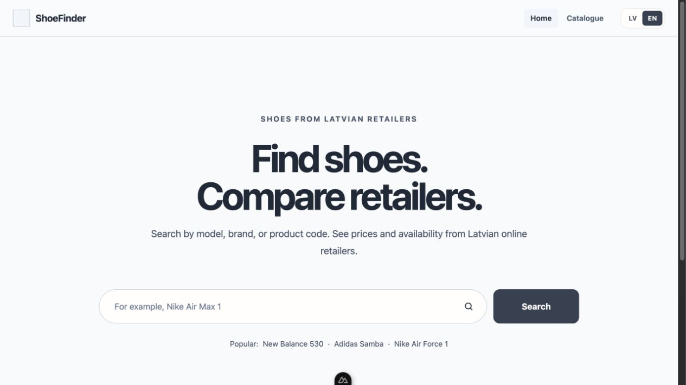
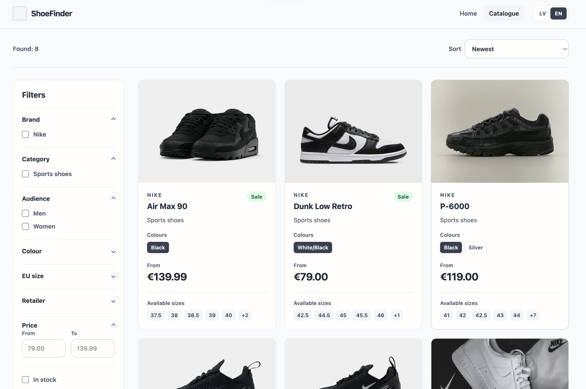
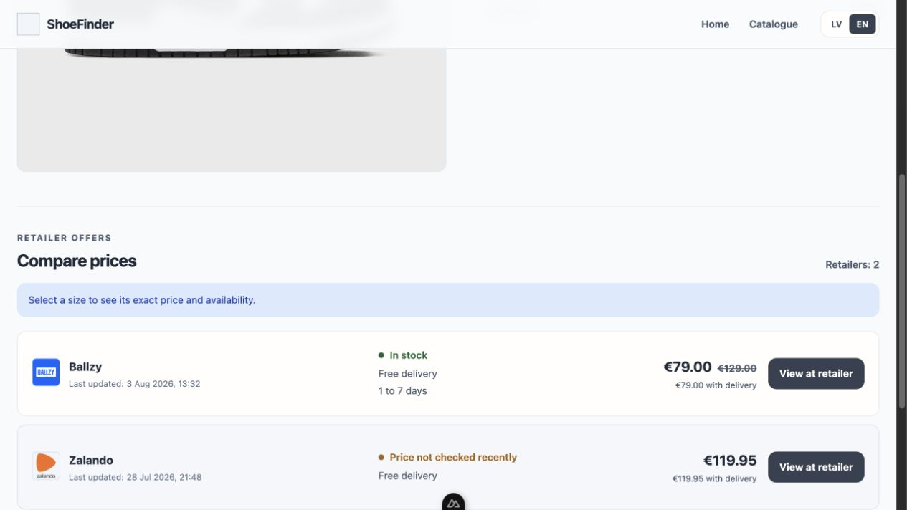
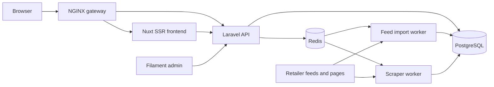

# ShoeFinder


A bilingual shoe-price comparison platform for Latvian retailers. ShoeFinder brings product variants, sizes, stock, delivery costs, and retailer prices into one searchable catalogue.

This portfolio project covers the complete product lifecycle: a server-rendered storefront, a documented public API, catalogue administration, feed and scraper ingestion, background jobs, automated testing, deployment, monitoring, and backups.



## What it does

- Searches and filters shoes by brand, category, audience, colour, EU size, retailer, price, stock, and sale status.
- Compares size-specific prices, availability, and delivery costs across retailers.
- Supports Latvian and English URLs, content, metadata, error pages, sitemap output, and robots rules.
- Keeps stable product URLs while allowing shoppers to switch between colour variants.
- Tracks outbound retailer clicks without storing raw IP addresses, user agents, or persistent visitor identifiers.
- Gives administrators a Filament dashboard for catalogue data, feed review, scrape previews, health metrics, and click analytics.
- Imports CSV, JSON, JSONL, and XML product feeds through a review-before-apply workflow.
- Runs allowlisted retailer-page scrapers asynchronously and presents changes before they can affect the catalogue.

## Screenshots

### Filterable catalogue



### Retailer comparison



## Engineering highlights

- **Variant-aware catalogue:** each colourway is independently searchable and priced while sharing one stable shoe model.
- **Freshness-aware pricing:** stale listings remain visible for transparency but cannot define the current lowest price.
- **Safe ingestion:** feed imports and scrape results are previewed, validated, matched, and explicitly approved before database changes are applied.
- **Asynchronous workflows:** Redis-backed workers isolate feed processing and retailer scraping from web requests.
- **Admin security:** every Filament administrator must enrol a TOTP authenticator and receives recovery codes.
- **Production-minded delivery:** immutable Docker images, explicit migrations, health checks, rotating logs, scheduled backups, and restore verification are included.
- **Quality gates:** the GitLab pipeline runs backend, frontend, and scraper tests together with PHP, JavaScript, CSS, and formatting checks.

## Architecture



| Area | Technology |
| --- | --- |
| Storefront | Nuxt 4, Vue 3, Tailwind CSS 4, Nuxt i18n |
| API and domain | Laravel 13, PHP 8.3+, Filament 5 |
| Data and queues | PostgreSQL 18, Redis 7.4 |
| Ingestion | PHP feed adapters, Python retailer scrapers |
| Infrastructure | Docker Compose, NGINX, GitLab CI/CD, systemd backup timers |
| Quality | PHPUnit, Node test runner, Python unittest, Pint, ESLint, Stylelint, Prettier |

## Run locally

### Requirements

- Docker Desktop with Docker Compose

No host installation of PHP, Composer, Node.js, npm, Python, PostgreSQL, or Redis is required.

### Setup

```sh
cp .env.example .env
cp backend/.env.example backend/.env

docker compose build
docker compose run --rm backend-php php artisan key:generate
docker compose run --rm backend-php php artisan storage:link
docker compose up -d
docker compose exec -T backend-php php artisan migrate --seed
```

Open [http://localhost:8080](http://localhost:8080). English pages are available under `/en`; the administrator panel is at [http://localhost:8080/admin](http://localhost:8080/admin).

The seeders create catalogue reference data such as colours and EU sizes. Product and retailer data can then be added through Filament or the feed-import workflow.

Create the first administrator interactively:

```sh
docker compose exec backend-php php artisan make:filament-user
```

The first sign-in requires TOTP two-factor authentication.

### Useful commands

```sh
# Service status and logs
docker compose ps
docker compose logs -f

# Automated tests and quality checks
docker compose exec -T backend-php php artisan test
docker compose exec -T frontend npm run test
docker compose exec -T backend-php composer format:check
docker compose exec -T frontend npm run quality
./docker/test-postgres.sh

# Stop the development stack without deleting its volumes
docker compose down
```

## Public API

| Endpoint | Purpose |
| --- | --- |
| `GET /api/v1/shoes` | Paginated, filterable catalogue cards |
| `GET /api/v1/shoes/{slug}` | Product, variants, sizes, and retailer offers |
| `GET /api/v1/catalog-filters` | Available catalogue filter values and price bounds |
| `GET /go/{listing}` | Privacy-conscious tracked redirect to a retailer |

Latvian is the default API locale. Add `locale=en` for English fields. Catalogue endpoints are rate-limited and return consistent JSON success and error envelopes.

Example:

```sh
curl "http://localhost:8080/api/v1/shoes?locale=en&brand[]=nike&in_stock=1&sort=price_asc"
```

## Data ingestion

The importer accepts retailer-specific CSV, JSON, JSONL, and XML feeds. It validates the complete input, matches records using strong product identifiers, and produces a change preview. An administrator must resolve review items and explicitly apply the import; one invalid input prevents a partial update.

Retailer page checks use a separate Python scraper worker with an allowlist, crawl delay, and identifiable user agent. Scrape runs also create a preview first, so a failed or unexpected page cannot silently overwrite catalogue data.

## Testing and delivery

The project contains focused coverage for catalogue queries, pricing and freshness rules, database relationships, feed adapters and imports, scrape preview/apply workflows, tracked redirects, admin authentication, localization, SEO, accessibility, image fallbacks, and the public UI.

The GitLab pipeline:

1. Runs Pint, ESLint, Stylelint, and Prettier checks.
2. Executes the Laravel, Nuxt, and Python scraper test suites.
3. Builds commit-addressed production images.
4. Provides protected, manual deployment followed by separate migration and health-verification stages.

Production containers do not migrate during startup. Backup tooling creates PostgreSQL dumps, media archives, metadata, and checksums, with an isolated verification command and optional remote storage. See [docker/systemd/README.md](docker/systemd/README.md) for the backup schedule and recovery workflow.

## Project notes

- ShoeFinder is an independent portfolio project and is not affiliated with the retailers or brands shown in demo data.
- Product images, retailer marks, and trademarks belong to their respective owners.
- Affiliate redirects are supported, and the public application includes an affiliate disclosure page.
